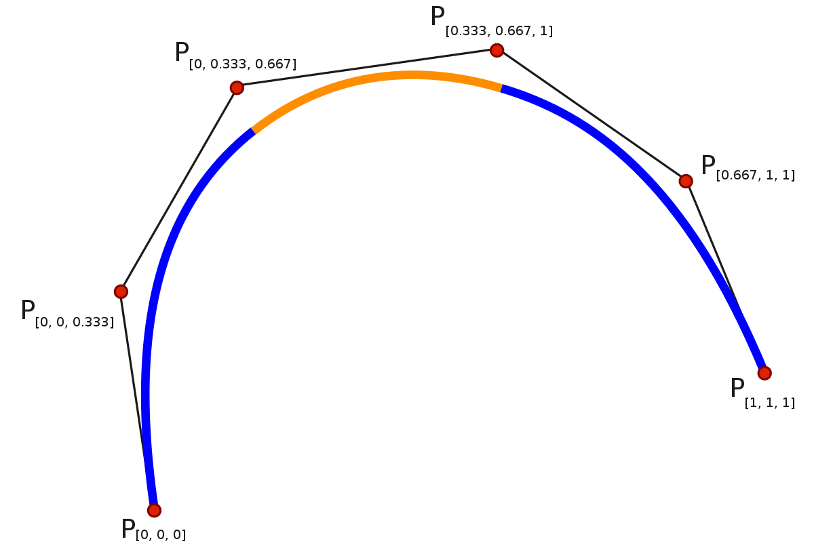
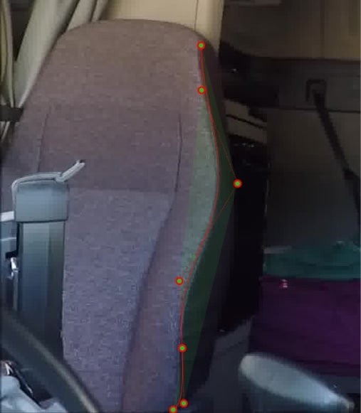

# Spline Drawer API with FLASK
In mathematics, a spline is a special function defined piecewise by polynomials. In interpolating problems, spline interpolation is often preferred to polynomial interpolation because it yields similar results, even when using low degree polynomials, while avoiding Runge's phenomenon for higher degrees [Wikipedia](https://en.wikipedia.org/wiki/Spline_(mathematics)).



This project contains a simple and tiny Flask API to draw Spline on images.

## Contents
1. Install requirements
2. How to run project
3. Use served APIs

#### Install requirements
This project contains a [requirements.txt](requirements.txt) file. Using this file, you are able to install required packages. First of all,
create a python3 virtual environments, then install packages inside the virtual environmnt.
```shell script
git clone https://gitlab.com/ehsanmqn/spline-drawer
cd spline-drawer
virtualenv -p python3 venv
source venv/bin/activate
pip install -r requirements.txt
```

#### How to run project
In order to run development server follow instruction bellow:
```shell script
python -m flask run --reload
```

#### Use served APIs
This is a very simple flask project that serves 2 separate APIs for the purpose of drawing B-spline. The first API, draws a B-Spline curve on a given image. For this purpose you should provide points (spline control polygon points) according to image aspect ration. The other API, on the other hand, finds interpolate and draw B-spline curve that go through determined points and or in other words a curve fitting using a cubic B-spline curve.

APIs paths:
```shell script
# Draw spiline curve using predefined points
http://{server_ip}:{server_port}/spline/draw/

# Find interpolate and draw spline curve
http://{server_ip}:{server_port}/spline/interpolate/
``` 

An [image](uploads/test.jpg) is provided in the [uploads](uploads) folder. 
In order to test APIs, you are welcome to use this image and define points according to the image size. 
You are free to use this image using following parameters.
```requirements.txt
x: 282,286,335,252,256,259,244
y: 64,127,257,396,492,568,578
k: 3
```


## Result
Following image is a result of drawing spline using the provided API




Happy coding!!!
